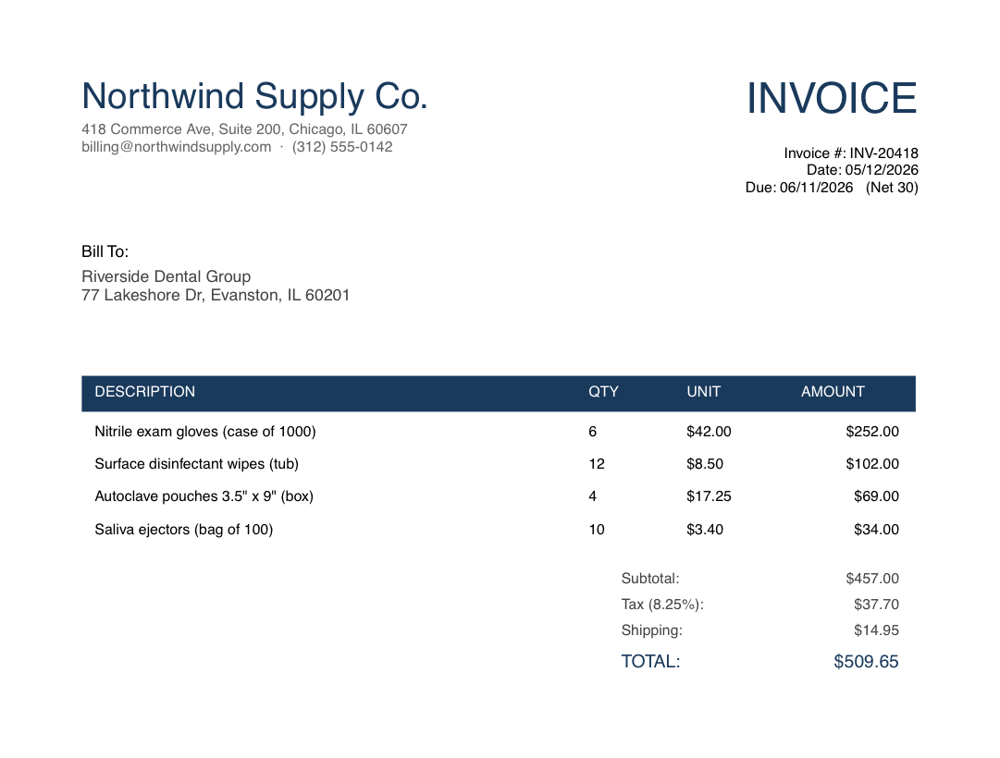
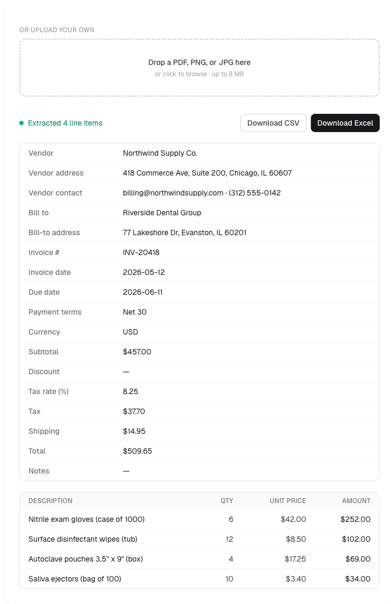

# Case study: Automating invoice data entry

## The problem

Most small businesses still process invoices by hand. Someone opens each PDF, reads it,
and retypes the vendor, the date, every line item, the tax, and the total into a
spreadsheet or accounting system. A few invoices a day is a quiet half-hour gone. A few
hundred a month is a part-time job, and every manual entry is a chance for a typo that
throws off the books.

The usual "fix," a template-based PDF parser, is brittle: it's set up for one vendor's
exact layout and breaks the moment an invoice looks a little different. Since every vendor
formats invoices their own way, that breaks constantly.

## What I built

A tool that reads an invoice the way a person would and hands back clean, structured data.

You drop in an invoice (a PDF, a scan, even a phone photo) and within a few seconds you
get back every field laid out in a table: vendor, bill-to, invoice number, dates, each
line item, subtotal, tax, and total. One click exports it to a CSV or Excel file.

Because it reads the document rather than matching a fixed template, it handles invoices it
has never seen before, from any vendor, in any layout.

| The invoice you start with | The data you get back |
| --- | --- |
|  |  |

## Why it's reliable enough to trust

Automation is only useful if you can trust it without re-checking everything by hand. Three
deliberate choices make that possible:

- **It reads messy real-world inputs.** A new vendor's layout or a skewed, shadowed phone
  photo, and it still pulls the legible fields correctly.
- **It can point you to the shaky bits.** On a rough scan it does its best to flag fields
  it's unsure about, so a quick human check lands where it's most likely needed. It's a
  best-effort assist, not a substitute for a glance at the numbers.
- **It knows what it's not.** Hand it something that isn't an invoice and it says so,
  instead of returning nonsense.

## The result

What was a manual, error-prone retyping task becomes a few-second upload. The output drops
straight into a spreadsheet, and the only human step left is a quick spot-check of the
numbers, not re-keying every field.

## What a build for your business would add

This is a demonstration on generic invoices. A version built for a specific business goes
further: **batch processing across your full invoice volume**, tuned to your vendors'
formats, and wired directly into your spreadsheet, accounting software, or CRM, so the data
entry simply stops being something anyone has to do.
